<div dir="rtl" align="right">

# دليل المدير

دليل شامل لمدير **مبادرة العجاونة**: إنشاء الحساب، والمشرفون وصلاحياتهم، والمستفيدون، والحوالات، والاستعادة، والأمان، و**التصميم** (الهوية والصفحات والقوائم)، وصحة النظام، وأوامر Laravel Cloud.

> الأرقام الحمراء في الصور تشير إلى الخطوات المشروحة تحت كل صورة. الصور من نسخة تجريبية بأسماء وهمية. مسار اللوحة في الصور `lawha` للتوضيح فقط، ومسارك الحقيقي هو قيمة `ADMIN_PATH`.

**المحتويات**

1. [إنشاء حساب المدير](#1-إنشاء-حساب-المدير)
2. [الدخول ولوحة التحكم](#2-الدخول-ولوحة-التحكم)
3. [المشرفون والصلاحيات](#3-المشرفون-والصلاحيات)
4. [المستفيدون (المبادرات)](#4-المستفيدون-المبادرات)
5. [الحوالات والمراجعة](#5-الحوالات-والمراجعة)
6. [إيصالات المبادرات](#6-إيصالات-المبادرات)
7. [الاستعادة: الطلبات والسجل والإحصائيات](#7-الاستعادة-الطلبات-والسجل-والإحصائيات)
8. [الأمان](#8-الأمان)
9. [الرسائل](#9-الرسائل)
10. [دليل التصميم: الهوية والصفحات والقوائم](#10-دليل-التصميم-الهوية-والصفحات-والقوائم)
11. [حاسبة التاريخ](#11-حاسبة-التاريخ)
12. [صحة النظام](#12-صحة-النظام)
13. [أوامر Laravel Cloud](#13-أوامر-laravel-cloud)
14. [نسيت كلمة مروري](#14-نسيت-كلمة-مروري)
15. [قواعد وحدود مهمة](#15-قواعد-وحدود-مهمة)

---

## 1. إنشاء حساب المدير

لا توجد صفحة ويب لإنشاء مدير. يتم ذلك فقط من لوحة **Laravel Cloud** ← تبويب **Commands**:

```
php artisan admin:invite 05XXXXXXXX
```

يطبع الأمر رابط دعوة ورابط واتساب جاهزًا. الرابط **صالح 48 ساعة، ويعمل مرة واحدة**.

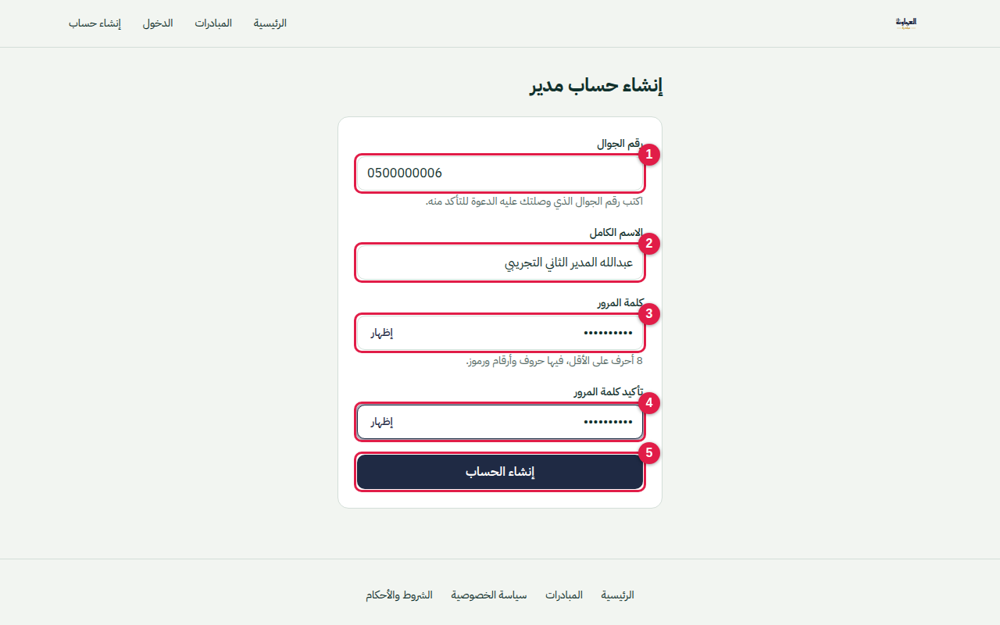

1. **رقم الجوال:** نفس الرقم المستخدم في الأمر. الصفحة لا تعرضه، بل تطلب كتابته للتأكد.
2. **الاسم الكامل.**
3. **كلمة المرور:** 8 أحرف على الأقل، **فيها حروف وأرقام ورموز**.
4. **تأكيد كلمة المرور.**
5. **إنشاء الحساب:** تدخل اللوحة مباشرة.

- **الرقم الخاطئ** يُرفض برسالة عامة. بعد **5 أرقام خاطئة** يُلغى الرابط، فأصدر دعوة جديدة.
- **الرقم المسجّل مسبقًا:** إذا ظهرت رسالة "مسجّل مسبقًا" عند تشغيل الأمر فالحساب موجود أصلًا. ادخل مباشرة، أو استعد كلمة المرور (القسم 14).

---

## 2. الدخول ولوحة التحكم

- ادخل من **`/login`** برقم الجوال وكلمة المرور.
- التحقق بخطوتين (رمز التطبيق) مُطفأ في الإنتاج (`TWO_FACTOR_REQUIRED=false`).
- الرابط **`/admin` غير موجود عمدًا.** مسار اللوحة سري وهو قيمة `ADMIN_PATH`.

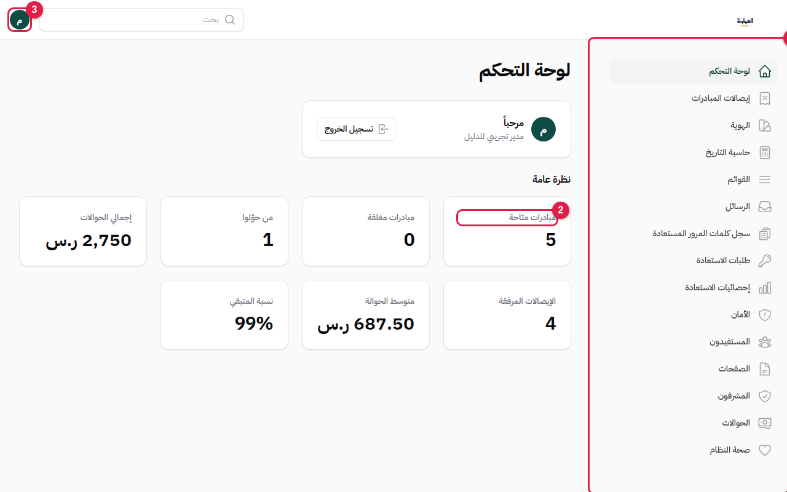

1. **القائمة الجانبية:** المدير يرى كل الصفحات دائمًا.
2. **نظرة عامة:** المبادرات المتاحة والمغلقة، ومن حوّلوا، وإجمالي الحوالات ومتوسطها، والإيصالات المرفقة، ونسبة المتبقي.
3. **قائمة المستخدم:** الوضع الفاتح أو الداكن، وتسجيل الخروج.

> إذا تغيّر حساب بنكي لمستفيد خلال آخر 14 يومًا يظهر لك تنبيه في لوحة التحكم.

---

## 3. المشرفون والصلاحيات

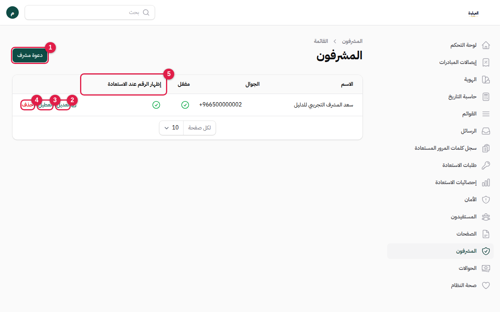

1. **دعوة مشرف.**
2. **تعديل:** الصلاحيات، وإظهار الرقم.
3. **تعطيل:** يمنع الدخول فورًا، ويمكن إعادة التفعيل لاحقًا.
4. **حذف:** يُمنع إذا ارتبط المشرف بسجلات أخرى، فعطّله بدلًا من حذفه.
5. **إظهار الرقم عند الاستعادة:** يعني أن رقم هذا المشرف يظهر للمبادرين في صفحة "نسيت كلمة المرور".

### دعوة مشرف

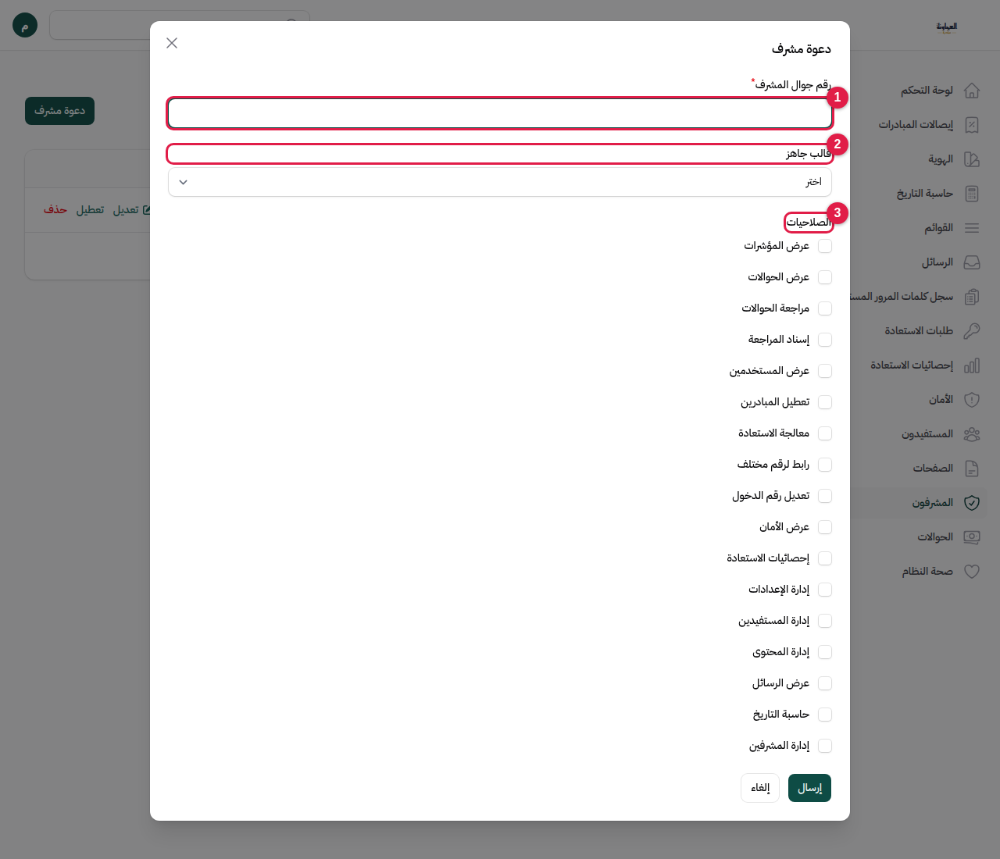

1. **رقم جوال المشرف.**
2. **قالب جاهز (اختياري):** يحدد مجموعة صلاحيات دفعة واحدة، ثم تعدّلها كما تريد.
3. **الصلاحيات:** حدد ما يحتاجه المشرف فقط.

عند الإرسال يفتح واتساب برسالة فيها الرابط جاهزة، فأرسلها للمشرف. الرابط صالح **48 ساعة ولمرة واحدة**، ويطلب من المشرف تأكيد رقمه، وكلمة مرور فيها حروف وأرقام ورموز.

**القوالب الجاهزة:**

| القالب | الصلاحيات | مناسب لـ |
|---|---|---|
| مراجع الحوالات | عرض المؤشرات، عرض الحوالات، مراجعة الحوالات | من يطابق الإيصالات |
| مسؤول الدعم والاستعادة | معالجة الاستعادة، عرض المستخدمين | من يساعد المبادرين في كلمات المرور |
| مشرف متابعة | عرض المؤشرات، عرض الحوالات، عرض المستخدمين، حاسبة التاريخ | من يتابع فقط |
| مشرف أمان | عرض الأمان، تعطيل المبادرين | من يراقب الحسابات المشبوهة |
| مسؤول المستفيدين | إدارة المستفيدين، عرض المؤشرات، عرض الحوالات | من يسجّل المبادرات |

### تعديل صلاحيات مشرف

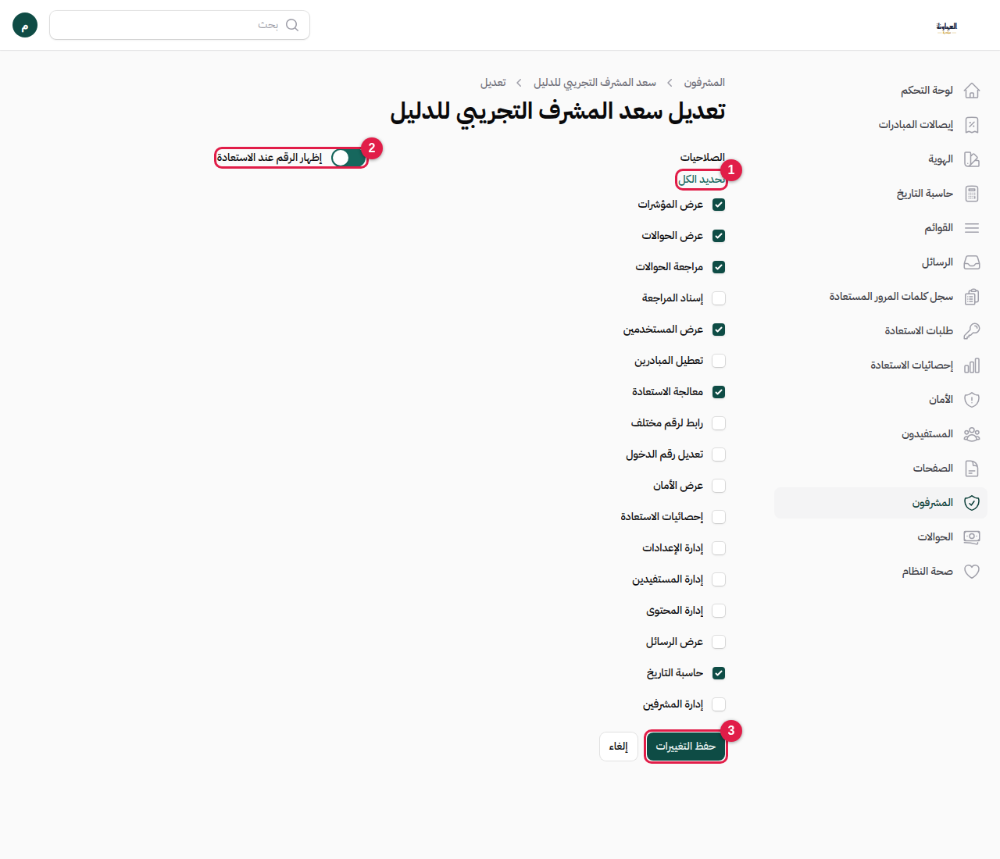

1. **تحديد الكل.** استخدمه بحذر.
2. **إظهار الرقم عند الاستعادة:** يعمل فقط إن كان المشرف يملك "معالجة الاستعادة".
3. **حفظ التغييرات:** تسري فورًا حتى لو كان المشرف داخل اللوحة الآن.

**جدول الصلاحيات كاملًا:**

| الصلاحية | ما تتيحه | الحساسية |
|---|---|---|
| عرض المؤشرات | بطاقات "نظرة عامة" | عادية |
| عرض الحوالات | صفحتا الحوالات وإيصالات المبادرات | عادية |
| مراجعة الحوالات | المطابقة، والتعليق والمراجعة النهائية عند الإسناد | عادية |
| إسناد المراجعة | إسناد المراجعة والمراجعة النهائية لمشرفين | مرتفعة |
| عرض المستخدمين | أسماء المبادرين وأرقامهم | عادية |
| تعطيل المبادرين | تعطيل حساب مبادر أو إعادة تفعيله | مرتفعة |
| معالجة الاستعادة | طلبات الاستعادة وإرسال الرابط للرقم المسجّل | مرتفعة |
| رابط لرقم مختلف | إرسال الرابط لرقم آخر بسبب إلزامي. تتطلب "معالجة الاستعادة" | **حساسة جدًا** |
| تعديل رقم الدخول | تغيير رقم جوال صاحب الطلب بسبب إلزامي. تتطلب "معالجة الاستعادة" | **حساسة جدًا** |
| عرض الأمان | صفحة الأمان | مرتفعة |
| إحصائيات الاستعادة | صفحة إحصائيات الاستعادة | مرتفعة |
| إدارة الإعدادات | الإعدادات العامة | **حساسة جدًا** |
| إدارة المستفيدين | إضافة المبادرات وتعديل حساباتها وإغلاقها | **حساسة جدًا** |
| إدارة المحتوى | الهوية والصفحات والقوائم | **حساسة جدًا** |
| عرض الرسائل | رسائل "اتصل بنا" | عادية |
| حاسبة التاريخ | حاسبة الهجري والميلادي | عادية |
| إدارة المشرفين | دعوة المشرفين وتعديلهم وتعطيلهم | **حساسة جدًا** |

- **الصلاحيات الحساسة جدًا** يمنحها المدير وحده.
- **المشرف** الذي يملك "إدارة المشرفين" لا يستطيع منح صلاحية لا يملكها، ولا تعديل صلاحياته هو.

---

## 4. المستفيدون (المبادرات)

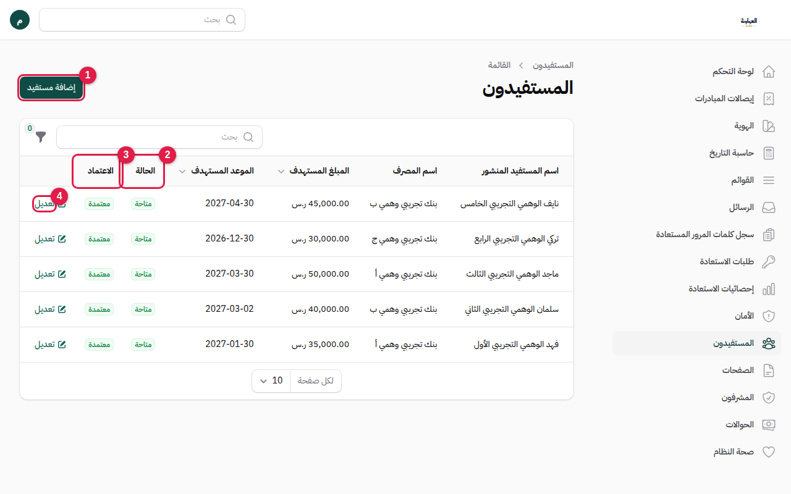

1. **إضافة مستفيد.**
2. **الحالة:** متاحة (تستقبل الحوالات) أو مغلقة.
3. **الاعتماد:** المبادرة **لا تظهر للعامة قبل الاعتماد**.
4. **تعديل.**

### إضافة مستفيد

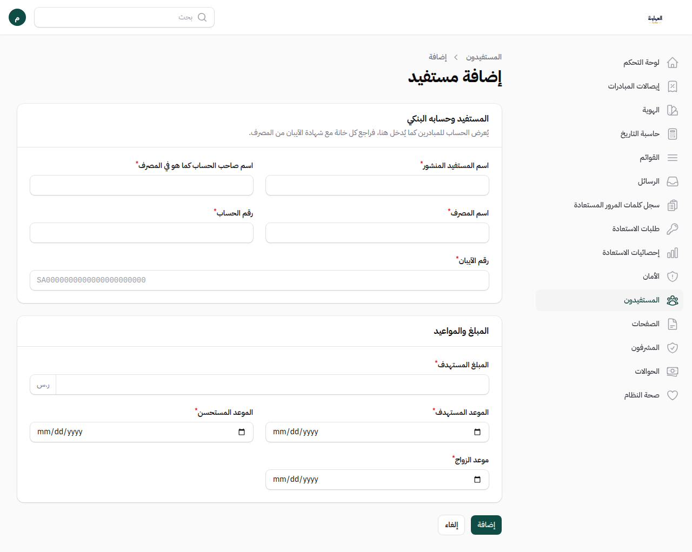

**بيانات المستفيد والحساب:**

- **اسم المستفيد المنشور:** يظهر كاملًا للجميع.
- **اسم صاحب الحساب كما هو في المصرف:** بحروف المصرف نفسها.
- **اسم المصرف.**
- **رقم الحساب.**
- **رقم الآيبان:** يبدأ بـ `SA`، ويتحقق النظام من صيغته.

**المبلغ والمواعيد:**

- المبلغ المستهدف.
- الموعد المستهدف.
- الموعد المستحسن.
- موعد الزواج.

> راجع كل خانة مع شهادة الآيبان من المصرف قبل الحفظ. المبادرون سيحوّلون إلى هذا الحساب مباشرة.

### التعديل والاعتماد والإغلاق

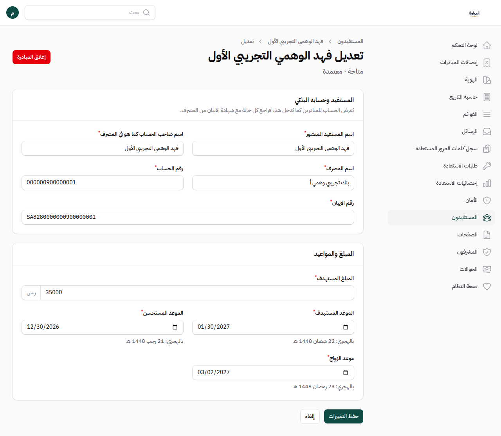

- **اعتماد:** يظهر في أعلى الصفحة للمبادرة غير المعتمدة. بعد الاعتماد تظهر للعامة ويُعرض حسابها.
- **إغلاق المبادرة** (الزر الأحمر): يوقف استقبال حوالات جديدة، وتبقى الحوالات السابقة قابلة للمراجعة. ويمكن **إعادة فتح المبادرة** لاحقًا.
- **تغيير الحساب البنكي:**
  - يطلب تأكيدًا صريحًا.
  - يُسجَّل بالقيمة القديمة والجديدة.
  - **يُلغي الاعتماد** فتختفي المبادرة من القوائم العامة حتى تعيد اعتمادها. هذه حماية من تحويل التبرعات إلى حساب خاطئ.

---

## 5. الحوالات والمراجعة

كل حوالة تُحتسب في الإحصائيات فور رفع إيصالها. المراجعة **اختيارية** وللمطابقة فقط.

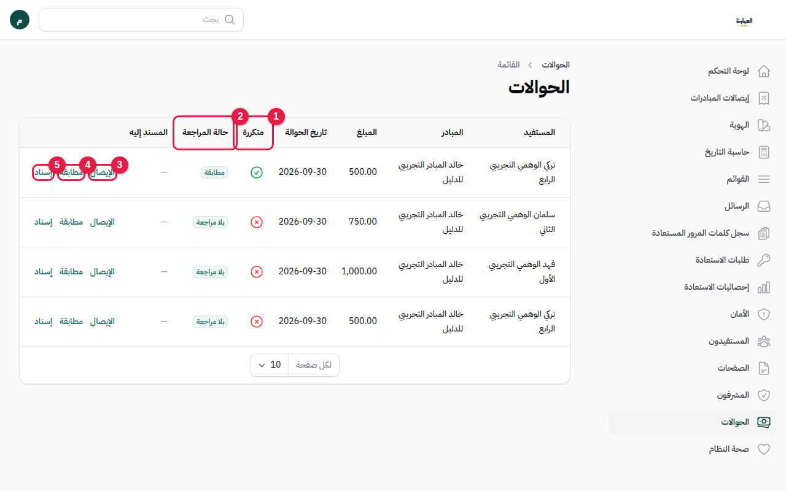

1. **متكررة:** ✓ يعني اشتباه تكرار: نفس الإيصال، أو رقم العملية، أو نفس البيانات. العلامة لا تمنع الحوالة.
2. **حالة المراجعة:** بلا مراجعة، أو مطابقة، أو معلّق عليها، أو مراجعة نهائية.
3. **الإيصال:** رابط مؤقت لصورة الإيصال.
4. **مطابقة:** تسجيل أن الإيصال مطابق.
5. **إسناد:** إسناد مراجعة الحوالة إلى مشرف.

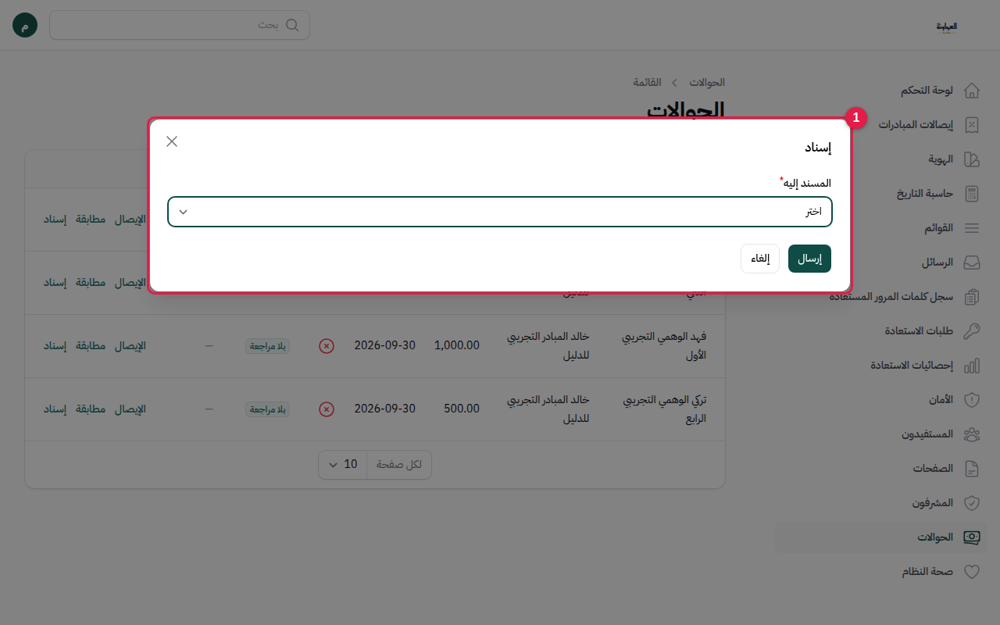

1. اختر **المسند إليه** ثم **إرسال**. يظهر هنا المشرفون الذين يملكون "مراجعة الحوالات".

**مسار الحوالة المتكررة:**

1. **الإسناد:** تسند الحوالة إلى مشرف.
2. **التعليق:** المشرف **يعلّق فقط** على المتكررة.
3. **الإسناد النهائي:** يظهر لك زر **إسناد للمراجعة النهائية** إلى المشرف نفسه.
4. **المراجعة النهائية:** يسجّل المشرف قراره وملاحظته الختامية.

كل خطوة تُحفظ في سجل التدقيق.

---

## 6. إيصالات المبادرات

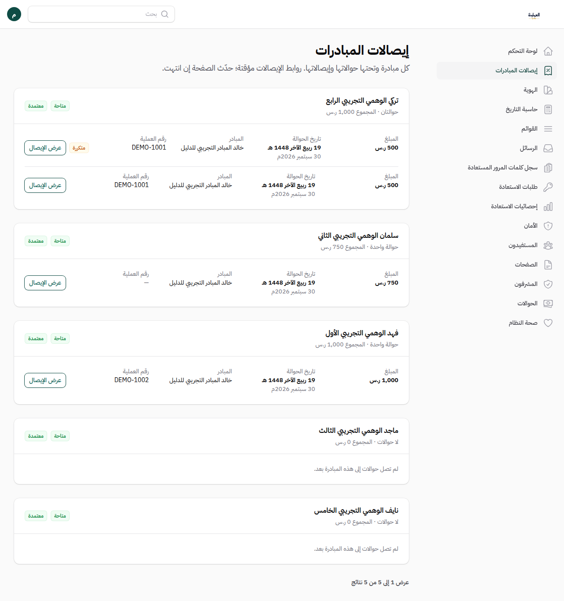

- إيصالات كل مبادرة مجمّعة.
- **مدة الاحتفاظ:** تُحذف صور إيصالات المبادرة تلقائيًا بعد **6 أشهر من إغلاقها**، وتبقى بيانات الحوالة نفسها دائمًا.

---

## 7. الاستعادة: الطلبات والسجل والإحصائيات

**طلبات الاستعادة** تعمل عندك كما عند المشرف. انظر القسم 6 في [دليل المشرف](supervisor-guide.md#6-طلبات-استعادة-كلمة-المرور).

### سجل كلمات المرور المستعادة (للمدير فقط)

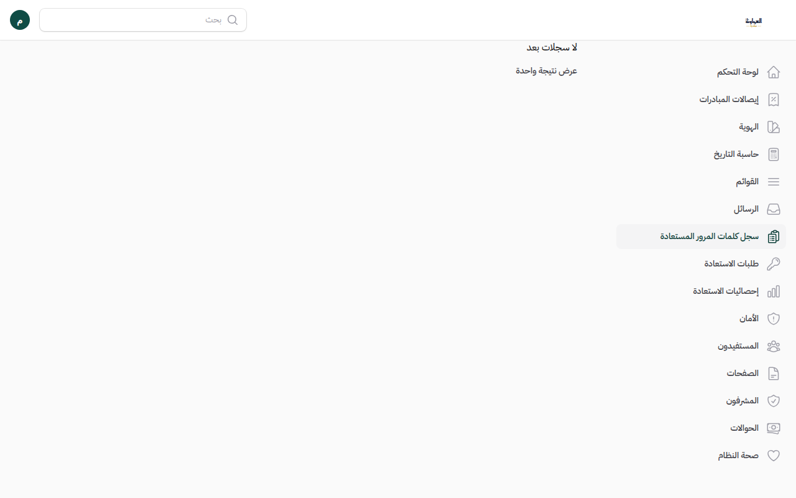

- كل عملية استعادة: صاحب الطلب، والمشرف، ونوع الإجراء (رابط للرقم المسجّل، أو لرقم مختلف، أو تعديل رقم الدخول)، والرقم القديم والجديد، والسبب، والتوقيت.
- **لا يُعدَّل ولا يُحذف.**

### إحصائيات الاستعادة

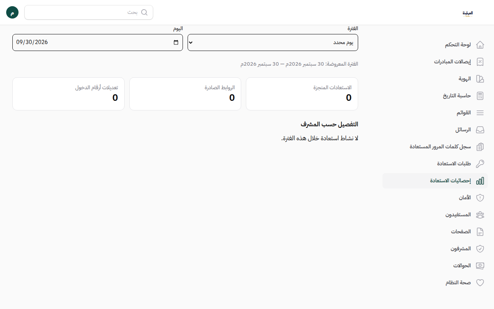

- **الفترة:** اختر يومًا أو شهرًا أو سنة أو فترة محددة.
- **ما تعرضه:** عدد الاستعادات المنجزة، والروابط الصادرة، وتعديلات أرقام الدخول، مفصّلة حسب المشرف ونوع الإجراء.
- **المشرفون:** تستطيع منح هذه الصفحة لمشرف بصلاحية "إحصائيات الاستعادة".

---

## 8. الأمان

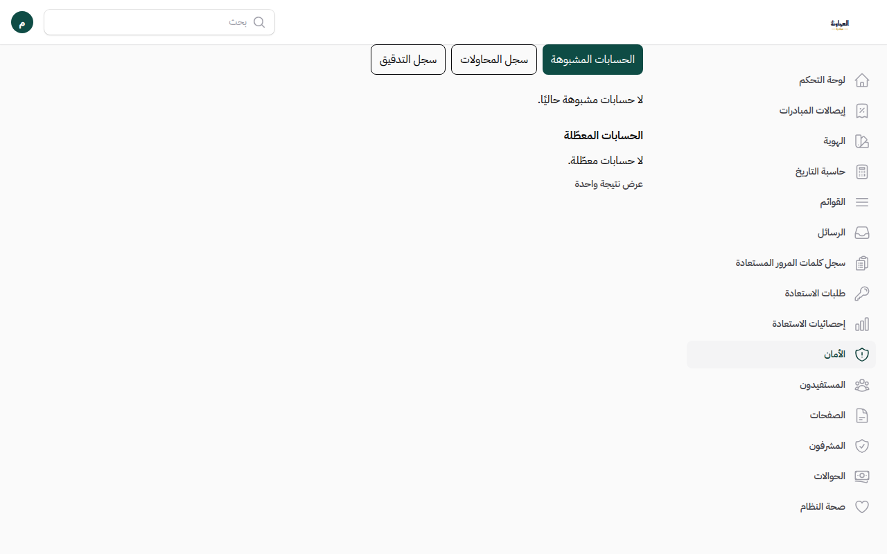

- **الحسابات المشبوهة:** مبادرون تكررت عليهم محاولات دخول فاشلة، أو سُجّلت حسابات كثيرة من نفس العنوان، أو كثرت طلبات استعادتهم. منها تعطّل الحساب بسبب يُحفظ، وتعيد تفعيله.
- **الحسابات المعطّلة:** قائمة بمن عُطّل.
- **سجل المحاولات:** كل محاولة دخول، ناجحة أو فاشلة، مع العنوان والوقت.
- **سجل التدقيق:** كل إجراء إداري: من فعله، ومتى، وعلى ماذا. **لا يُعدَّل ولا يُحذف.**

> بعد أول دخول لك في الإنتاج تأكد أن عنوان IP في سجل المحاولات هو عنوانك الحقيقي.

---

## 9. الرسائل

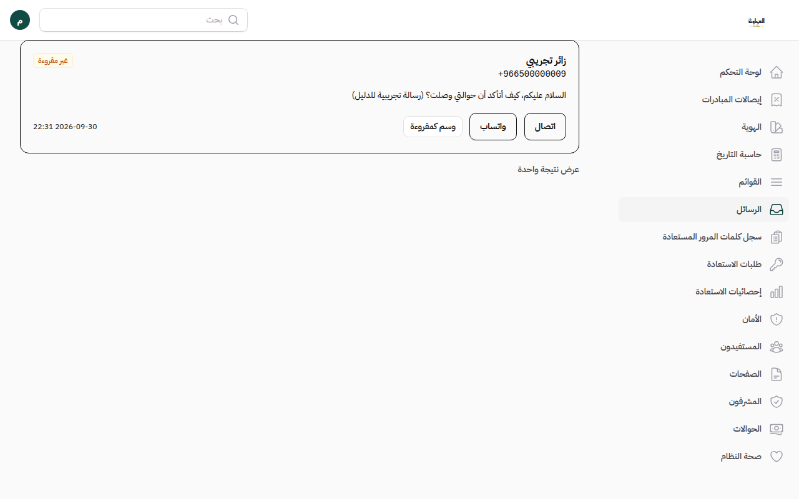

رسائل نموذج "اتصل بنا": الاسم والجوال والرسالة. يُحمى النموذج بـ Turnstile وبحد لعدد الرسائل.

---

## 10. دليل التصميم: الهوية والصفحات والقوائم

كل ما يلي يتطلب صلاحية **إدارة المحتوى**، وكل تعديل يُسجَّل في سجل التدقيق.

### 10.1 الهوية

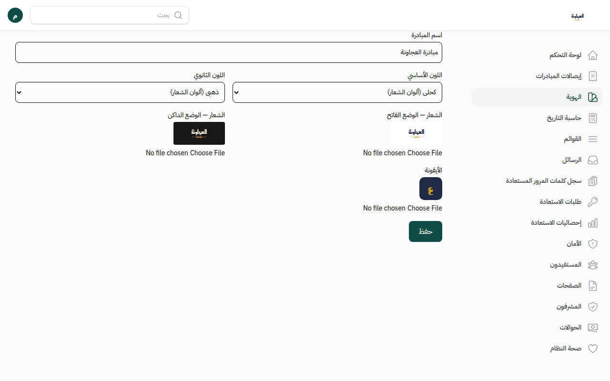

- **اسم المبادرة:** يظهر في الترويسة وعنوان المتصفح.
- **اللون الأساسي واللون الثانوي:**
  - تختارهما من لوحة ألوان مضبوطة مسبقًا.
  - يفحص النظام **التباين** تلقائيًا، ويرفض أي تركيبة تجعل النص غير مقروء.
- **الشعار للوضع الفاتح:** يُعرض على خلفية فاتحة.
- **الشعار للوضع الداكن:** يُعرض على خلفية داكنة.
- **الأيقونة:** تظهر في تبويب المتصفح وعند حفظ الموقع على الجوال. استخدم صورة مربعة.
- **حفظ.**

**نصائح التصميم:**

- **حجم الصور:** حتى 2 ميجابايت.
- **الأبعاد:** معقولة، وليست صورًا ضخمة من الكاميرا.
- **الصيغة:** يُفضَّل PNG بخلفية شفافة.
- **الوضعان:** جرّب الشعار في الفاتح والداكن قبل الاعتماد.
- **الألوان:** لا تغيّرها كثيرًا، فثبات الهوية يبني الثقة.

### 10.2 الصفحات

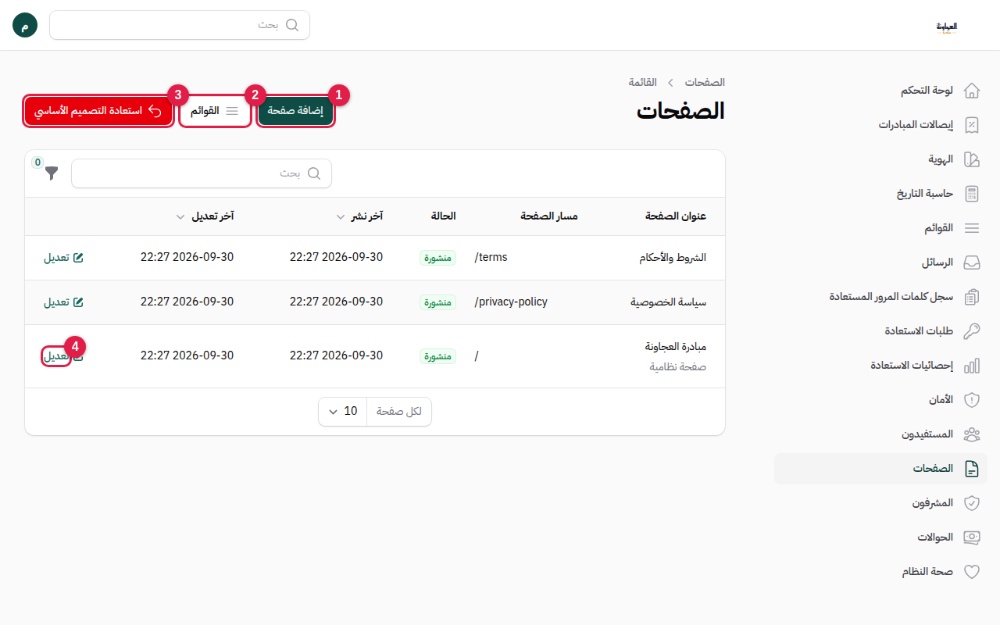

1. **إضافة صفحة:** صفحة جديدة، مثل "من نحن".
2. **القوائم:** ترتيب روابط الترويسة والتذييل.
3. **استعادة التصميم الأساسي:** يعيد الصفحة الرئيسية والقائمة الرئيسية وقائمة التذييل إلى التصميم الأصلي، ويظهر ذلك للزوار فورًا. لا يُحذف شيء: يمكنك التراجع باسترجاع النسخة السابقة من سجل النسخ.
4. **تعديل** صفحة.

**محرّر الصفحة (منشئ الصفحات):**

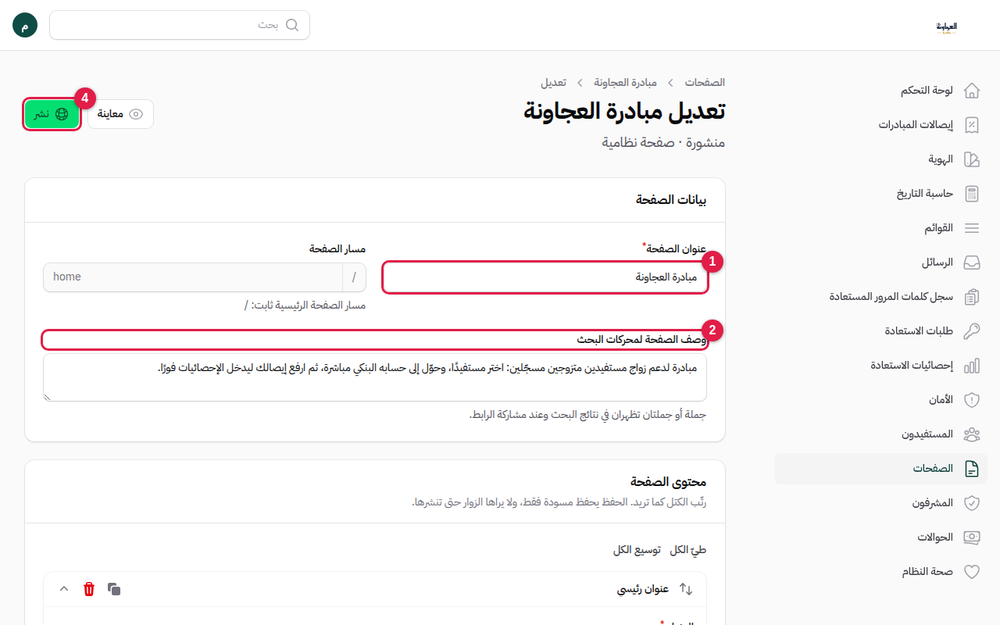

1. **عنوان الصفحة.**
2. **وصف الصفحة لمحركات البحث:** جملة أو جملتان تظهران في نتائج البحث وعند مشاركة الرابط.
3. **معاينة** (بجانب زر نشر): ترى الصفحة قبل نشرها.
4. **نشر:** الحفظ وحده يحفظ **مسودة** لا يراها الزوار، والنشر يجعلها ظاهرة.

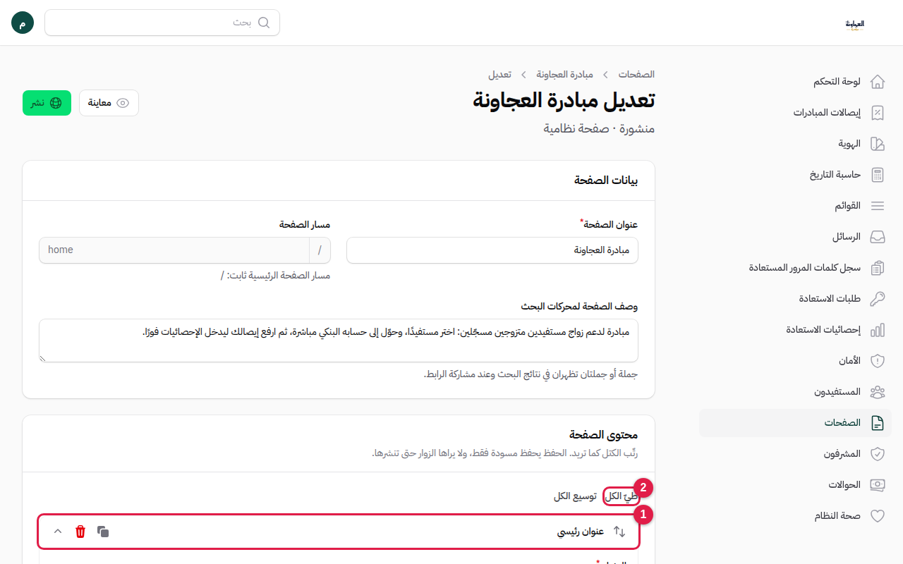

1. **شريط الكتلة:**
   - السهمان: تحريك الكتلة لأعلى أو لأسفل.
   - النسخ: تكرار الكتلة.
   - سلة المهملات: حذفها.
   - السهم الصغير: طيّها.
2. **طيّ الكل / توسيع الكل:** لرؤية ترتيب الكتل بسرعة.

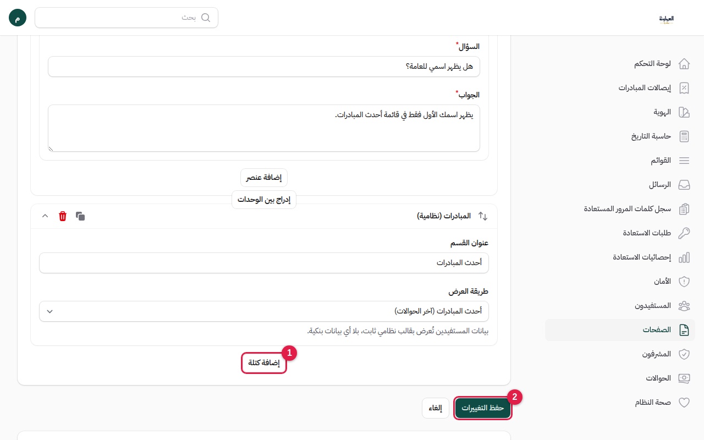

1. **إضافة كتلة**، واختر نوعها:
   - **عنوان رئيسي:** عنوان ونص تعريفي وأزرار، مع خيار إظهار بطاقتي المبادرات المتاحة والمغلقة.
   - **نص منسّق:** فقرات وقوائم وروابط.
   - **صورة.**
   - **بطاقات.**
   - **خطوات:** مثل "كيف تشارك".
   - **أسئلة شائعة.**
   - **عدّادات.**
   - **اتصل بنا:** نموذج مراسلة وأزرار اتصال وواتساب.
   - **فاصل.**
   - **المبادرات (نظامية):** تسحب الأرقام والبطاقات من النظام تلقائيًا، ولا تُكتب يدويًا.
2. **حفظ التغييرات:** يحفظ مسودة. ثم انشر.

**قواعد منشئ الصفحات:**

- **الحساب البنكي:** رقم الحساب والآيبان يظهران **فقط** عبر كتل "المبادرات" النظامية، فلا تكتبهما يدويًا في أي نص.
- **الصفحات النظامية:** صفحات التسجيل والدخول ولوحة المبادر والاستعادة وبيانات المستفيدين خارج المنشئ، ولا تُعدَّل منه.
- **سجل النسخ:** لكل صفحة سجل نسخ للتراجع عن أي تعديل.
- **الحدود:** 50 صفحة، و30 كتلة لكل صفحة.

### 10.3 القوائم

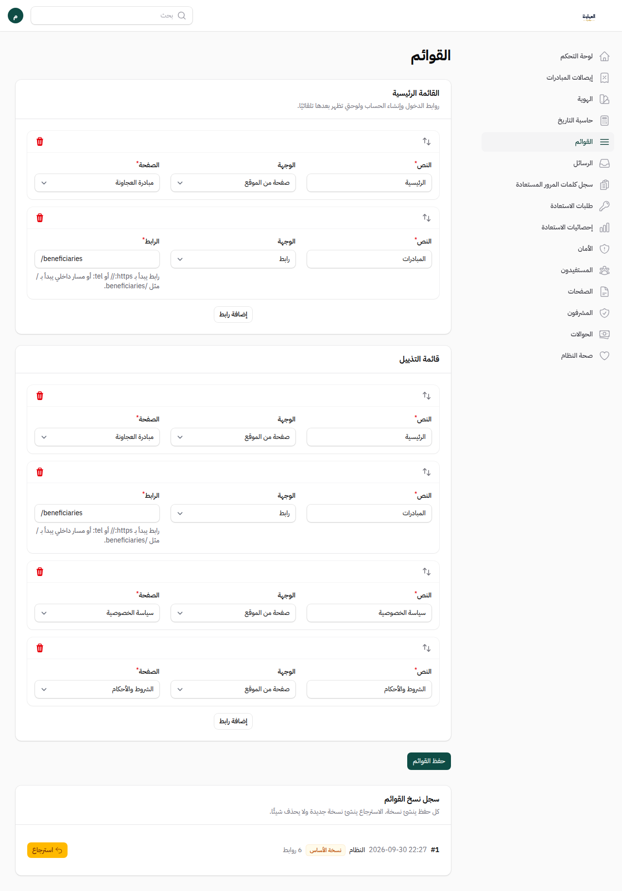

- **قائمتان:** الترويسة (أعلى الموقع) والتذييل (أسفله).
- **العناصر:** أضف أو احذف أو رتّب، حتى 8 عناصر لكل قائمة.
- **الرابط:** إما صفحة من الصفحات المنشورة، وإما رابط تكتبه.

---

## 11. حاسبة التاريخ

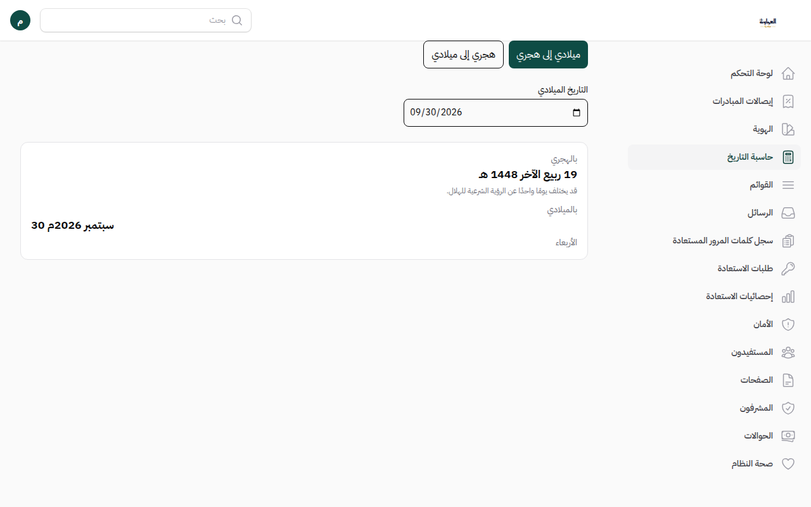

تحويل بين الهجري (أم القرى) والميلادي بالاتجاهين. قد يختلف الهجري يومًا عن الرؤية.

---

## 12. صحة النظام

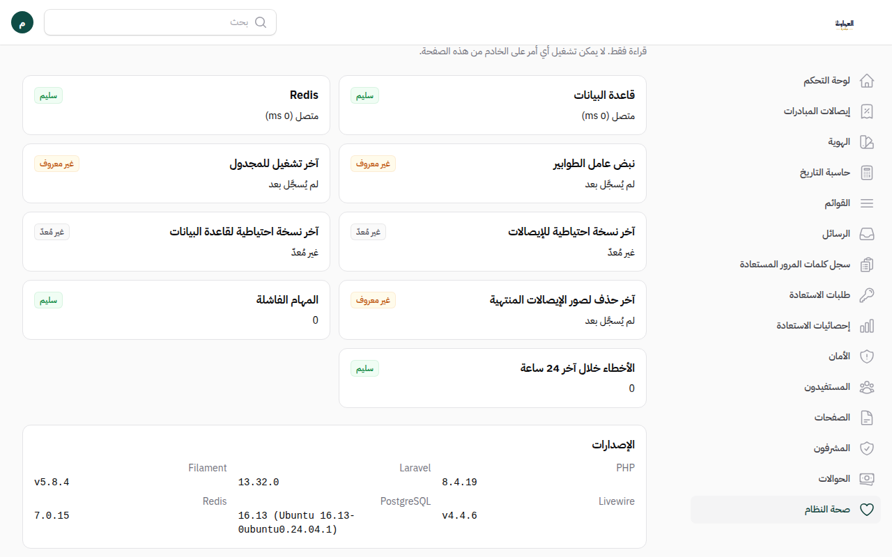

صفحة **للقراءة فقط**، للمدير وحده. راجعها أسبوعيًا:

| البند | المطلوب |
|---|---|
| قاعدة البيانات، Redis | "سليم" |
| نبض عامل الطوابير، آخر تشغيل للمجدول | "سليم" خلال دقائق من النشر |
| آخر نسخة احتياطية لقاعدة البيانات وللإيصالات | "سليم" بعد تفعيل النسخ الاحتياطي |
| المهام الفاشلة، الأخطاء خلال 24 ساعة | صفر أو قريب منه |

- **"غير معروف" أو "لم يُسجَّل بعد"** بعد النشر: تأكد من تفعيل Scheduler وQueue worker في Laravel Cloud.
- **التنبيهات:** تصل إلى البريد المضبوط في `ALERT_EMAIL` عند أي خلل.

---

## 13. أوامر Laravel Cloud

كلها من لوحة **Laravel Cloud** ← بيئة `production` ← تبويب **Commands**. لا يوجد زر في الموقع يشغّل أوامر على الخادم.

| الأمر | الغرض |
|---|---|
| `php artisan admin:invite 05XXXXXXXX` | دعوة مدير جديد: رابط 48 ساعة ولمرة واحدة |
| `php artisan admin:reset-link 05XXXXXXXX` | رابط تعيين كلمة مرور لمدير أو مشرف: 48 ساعة، بتأكيد رقم الجوال، وينهي كل جلساته |
| `php artisan admin:reset-password 05XXXXXXXX` | نفس الأمر السابق باسم آخر |
| `php artisan migrate --force` | تحديث قاعدة البيانات (موجود في أوامر النشر) |
| `php artisan alerts:test` | إرسال تنبيه تجريبي إلى البريد |
| `php artisan backup:list` | عرض النسخ الاحتياطية |

التفاصيل التقنية الكاملة في `docs/RUNBOOK.md` و`docs/DEPLOY-NOTES.md`.

---

## 14. نسيت كلمة مروري

1. من **Commands** في Laravel Cloud شغّل:
   ```
   php artisan admin:reset-link 05XXXXXXXX
   ```
2. افتح الرابط الذي يظهر:

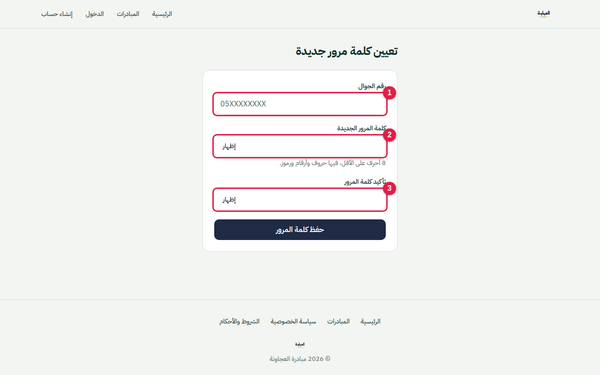

1. **رقم الجوال** المسجّل. بعد **5 أرقام خاطئة** يُلغى الرابط، فأصدر رابطًا جديدًا.
2. **كلمة المرور الجديدة:** 8 أحرف على الأقل، فيها حروف وأرقام ورموز.
3. **تأكيد كلمة المرور.**

بعد التعيين تنتهي كل جلساتك على كل الأجهزة، فادخل من جديد من `/login`. والأمر نفسه يعمل لأي مشرف ينسى كلمة مروره.

---

## 15. قواعد وحدود مهمة

- **مدير واحد على الأقل:** يجب أن يبقى مدير فعّال واحد على الأقل، ولا يستطيع المدير تخفيض دوره بنفسه.
- **صلاحيات المدير** ثابتة ولا تُسحب.
- **الروابط:** كل روابط الدعوة والاستعادة سرية، ولمرة واحدة، ولها مدة. ويُلغى الرابط بعد 5 أرقام جوال خاطئة.
- **سجل التدقيق:** كل إجراء إداري يُسجَّل فيه، ولا يُعدَّل ولا يُحذف.
- **لا بريد ولا رسائل تلقائية للمستخدمين:** الروابط تُرسل يدويًا عبر واتساب من جهاز المشرف أو المدير.
- **مسار اللوحة (`ADMIN_PATH`):** لا تنشره.

</div>
