

# دليل المشرف

دليل لكل مشرف في لوحة إدارة **مبادرة العجاونة**: كيف تنشئ حسابك من رابط الدعوة، وماذا ترى في اللوحة، وكيف تطابق الحوالات، وتعالج طلبات استعادة كلمة المرور.

> الأرقام الحمراء في الصور تشير إلى الخطوات المشروحة تحت كل صورة. الصور من نسخة تجريبية بأسماء وهمية.

**المحتويات**

1. [إنشاء حسابك من رابط الدعوة](#1-إنشاء-حسابك-من-رابط-الدعوة)
2. [الدخول واللوحة](#2-الدخول-واللوحة)
3. [الصلاحيات: لماذا لا أرى كل الصفحات؟](#3-الصلاحيات-لماذا-لا-أرى-كل-الصفحات)
4. [الحوالات والمطابقة](#4-الحوالات-والمطابقة)
5. [إيصالات المبادرات](#5-إيصالات-المبادرات)
6. [طلبات استعادة كلمة المرور](#6-طلبات-استعادة-كلمة-المرور)
7. [حاسبة التاريخ](#7-حاسبة-التاريخ)
8. [قائمة المستخدم وتسجيل الخروج](#8-قائمة-المستخدم-وتسجيل-الخروج)
9. [نسيت كلمة مروري](#9-نسيت-كلمة-مروري)
10. [قواعد مهمة](#10-قواعد-مهمة)

---

## 1. إنشاء حسابك من رابط الدعوة

يرسل لك المدير رابط دعوة على واتساب. الرابط:

- **صالح 48 ساعة**، ويعمل **مرة واحدة فقط**.
- **خاص برقم جوالك**، فلا تشاركه مع أحد.

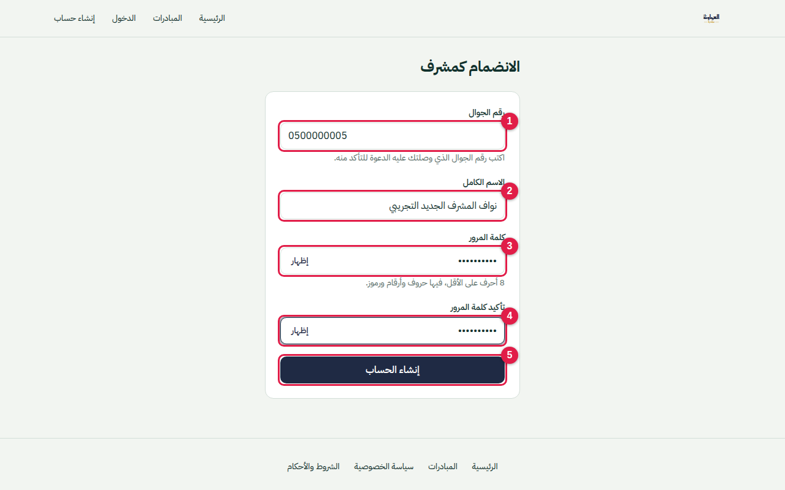

1. **رقم الجوال:** نفس الرقم الذي وصلتك عليه الدعوة.
2. **الاسم الكامل:** أربعة أسماء على الأقل.
3. **كلمة المرور:** 8 أحرف على الأقل، **فيها حروف وأرقام ورموز**، مثل `Aljawna#2026`.
4. **تأكيد كلمة المرور.**
5. **إنشاء الحساب:** تدخل اللوحة مباشرة.

إذا كتبت رقمًا غير الرقم المدعو:

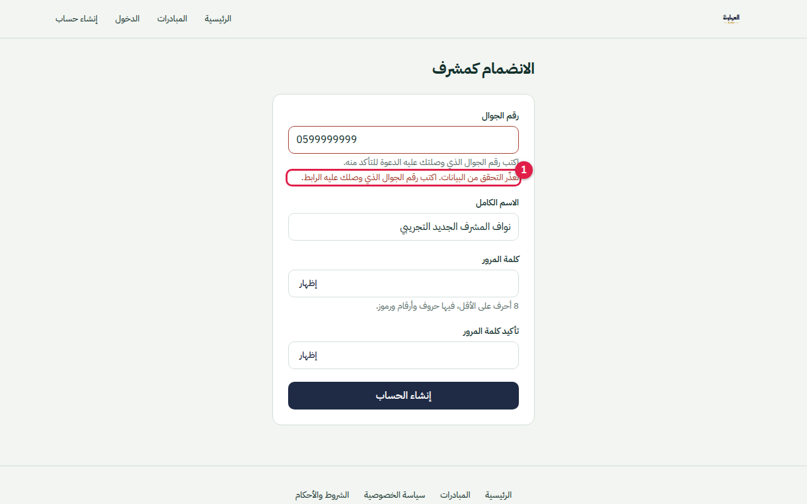

1. تظهر رسالة عامة لا تكشف الرقم الصحيح. صحّح الرقم وحاول مرة أخرى.

> بعد **5 أرقام خاطئة** يُلغى الرابط نهائيًا، فاطلب من المدير دعوة جديدة. وكذلك إذا انتهت المدة (48 ساعة).

---

## 2. الدخول واللوحة

- ادخل من صفحة **`/login`** في الموقع برقم جوالك وكلمة المرور فقط.
- بعد الدخول تنتقل إلى لوحة الإدارة مباشرة.

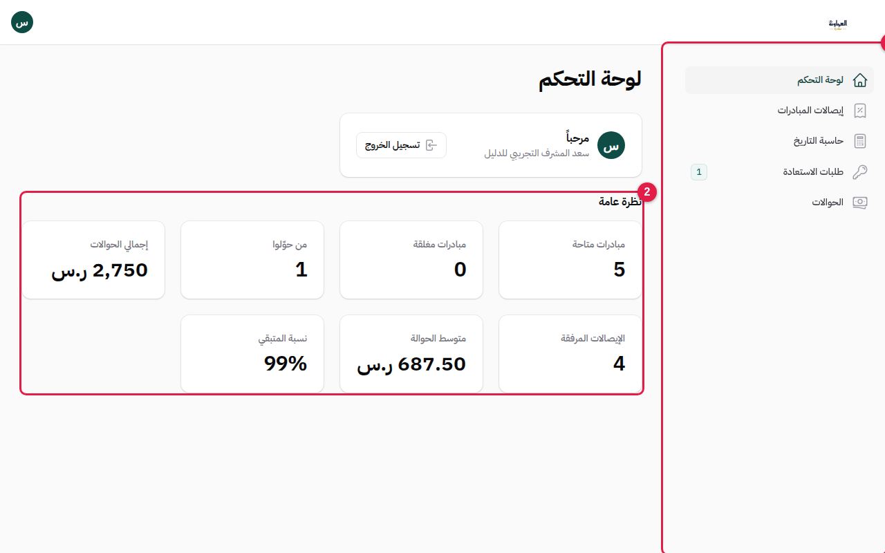

1. **القائمة الجانبية:** فيها الصفحات التي منحك المدير صلاحيتها فقط.
2. **نظرة عامة:** مؤشرات المبادرة. تظهر لمن يملك صلاحية "عرض المؤشرات".

---

## 3. الصلاحيات: لماذا لا أرى كل الصفحات؟

المدير يحدد لكل مشرف ما يراه. التغيير يسري فورًا، فإن اختفت صفحة أو ظهرت أخرى فهذا بقرار المدير.

| الصلاحية | ما تتيحه لك |
|---|---|
| عرض المؤشرات | بطاقات "نظرة عامة" في لوحة التحكم |
| عرض الحوالات | صفحة **الحوالات** وصفحة **إيصالات المبادرات** |
| مراجعة الحوالات | زر **مطابقة**، والتعليق والمراجعة النهائية لما يُسند إليك |
| إسناد المراجعة | إسناد مراجعة الحوالات إلى مشرفين آخرين |
| عرض المستخدمين | الاطلاع على أسماء المبادرين وأرقامهم |
| تعطيل المبادرين | تعطيل حساب مبادر مشبوه أو إعادة تفعيله، من صفحة **الأمان** |
| معالجة الاستعادة | صفحة **طلبات الاستعادة** |
| رابط لرقم مختلف | إرسال رابط الاستعادة إلى رقم واتساب غير المسجّل، بسبب إلزامي |
| تعديل رقم الدخول | تغيير رقم جوال صاحب الطلب، بسبب إلزامي |
| عرض الأمان | صفحة **الأمان**: الحسابات المشبوهة، وسجل المحاولات، وسجل التدقيق |
| إحصائيات الاستعادة | صفحة **إحصائيات الاستعادة** |
| إدارة المستفيدين | صفحة **المستفيدون**: الإضافة والتعديل والإغلاق |
| إدارة المحتوى | **الهوية** و**الصفحات** و**القوائم** |
| عرض الرسائل | صفحة **الرسائل** الواردة من نموذج "اتصل بنا" |
| حاسبة التاريخ | صفحة **حاسبة التاريخ** |
| إدارة المشرفين | صفحة **المشرفون** |

> إن فتحت رابطًا لصفحة لا تملك صلاحيتها ستظهر لك رسالة رفض. هذا طبيعي.

---

## 4. الحوالات والمطابقة

المطابقة **اختيارية**، والهدف منها التأكد أن الإيصال يطابق البيانات. الحوالة محتسبة في الإحصائيات من لحظة رفعها، ولا تؤثر المطابقة في احتسابها.

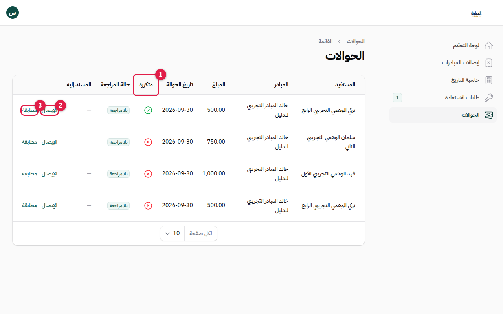

1. **متكررة:** علامة ✓ تعني أن النظام يشتبه أن الحوالة مكررة: نفس الإيصال، أو نفس رقم العملية، أو نفس المبادر والمستفيد والمبلغ والتاريخ. العلامة لا تمنع الحوالة، لكنها تستحق انتباهك.
2. **الإيصال:** يفتح صورة الإيصال في رابط مؤقت.
3. **مطابقة:** اضغطه بعد أن تتأكد أن الإيصال يطابق المبلغ والتاريخ والمستفيد.

بعد المطابقة تتغير حالة المراجعة:

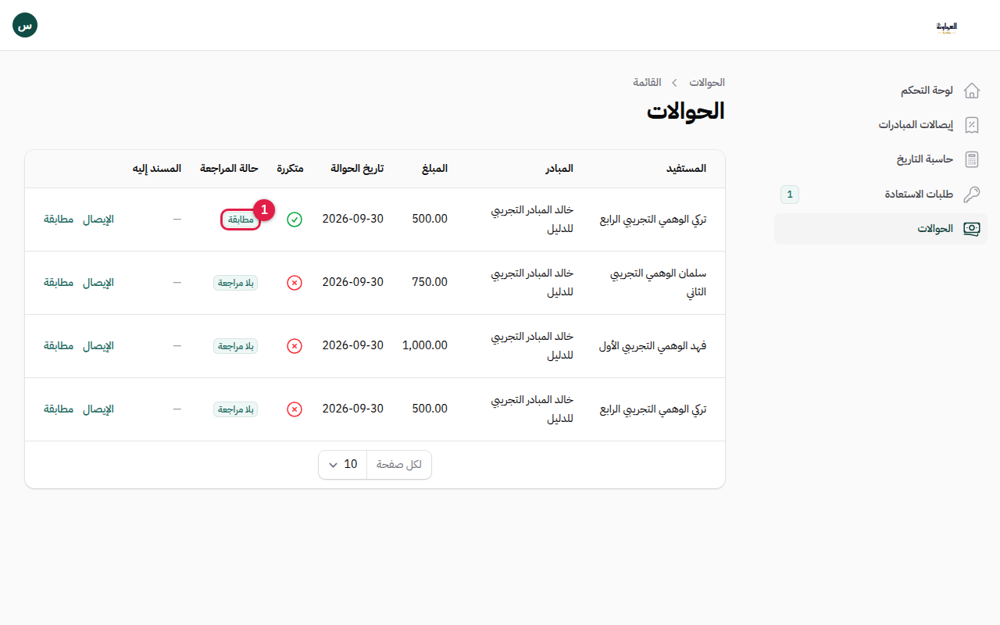

1. الحالة صارت **مطابقة**.

**إذا أُسندت إليك حوالة للمراجعة** (عند من يملك "مراجعة الحوالات"):

1. **التعليق:** يظهر لك زر **تعليق** على الحوالات المتكررة المسندة إليك. اكتب ملاحظتك.
2. **الإسناد النهائي:** بعد تعليقك قد يسند إليك من أسند الحوالة **المراجعة النهائية**.
3. **المراجعة النهائية:** اضغط **مراجعة نهائية** واكتب قرارك وملاحظتك الختامية.

كل ذلك يُسجَّل في سجل التدقيق.

---

## 5. إيصالات المبادرات

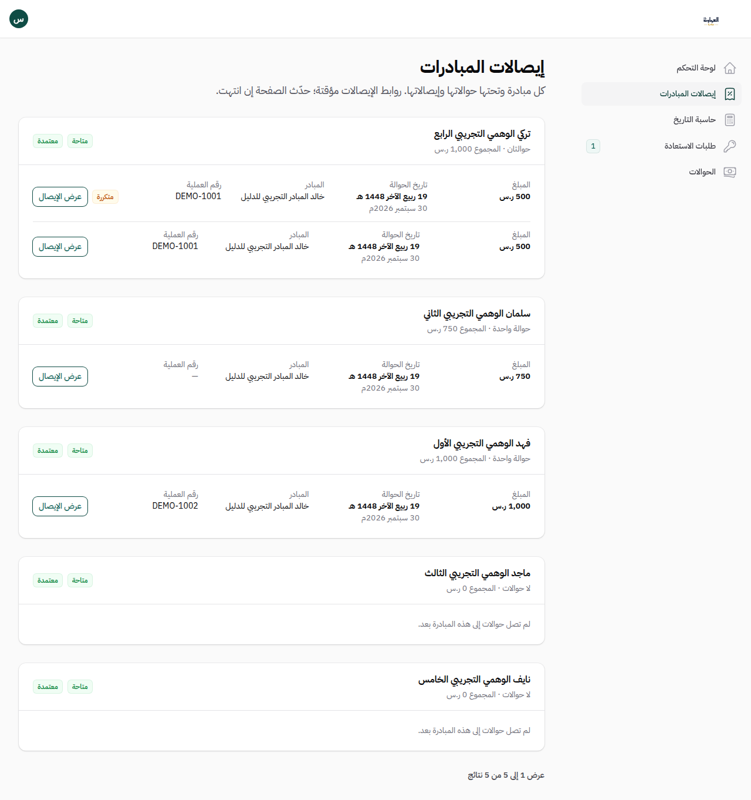

- تعرض إيصالات كل مبادرة مجمّعة، لتسهيل مراجعتها.
- روابط الإيصالات مؤقتة (10 دقائق)، فلا تنسخها لأحد.

---

## 6. طلبات استعادة كلمة المرور

عندما ينسى مبادر كلمة مروره، يدخل رقمه في صفحة "نسيت كلمة المرور". فيظهر طلبه عندك، ويرى هو أرقام المشرفين الذين فعّل لهم المدير "إظهار الرقم عند الاستعادة".

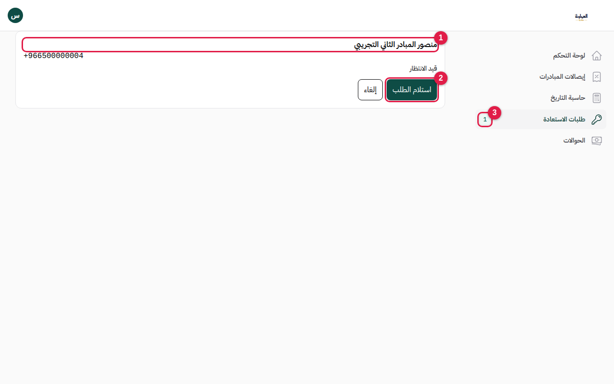

1. **صاحب الطلب:** الاسم الكامل ورقم الجوال المسجّلان. طابقهما مع الشخص الذي يتصل بك أو يراسلك.
2. **استلام الطلب:** يحجز الطلب لك 15 دقيقة، كي لا يعالجه مشرفان معًا.
3. **العدّاد:** عدد الطلبات الجديدة التي تنتظر.

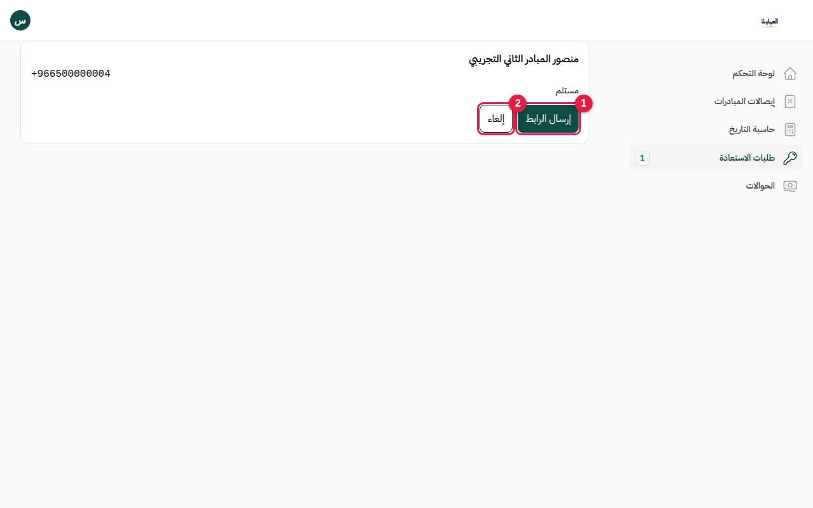

1. **إرسال الرابط.**
2. **إلغاء:** إن تبيّن أن الطلب غير صحيح.

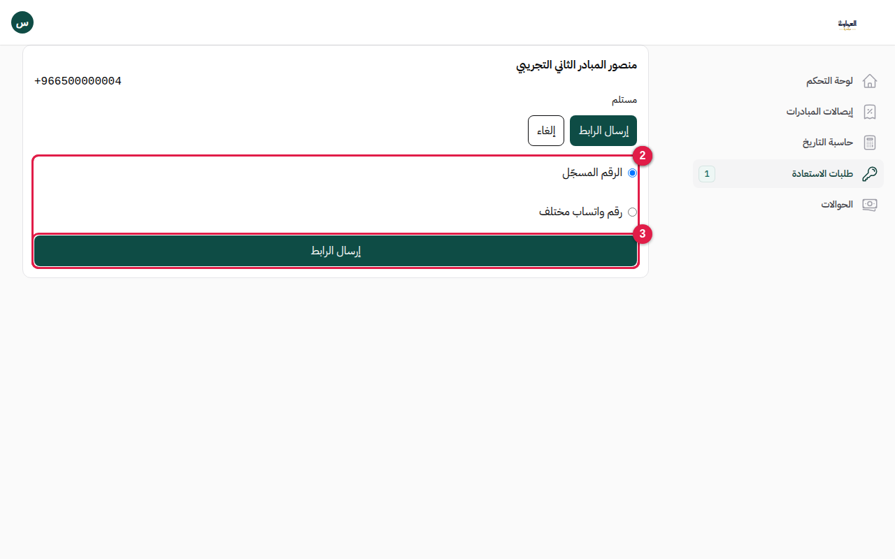

1. **الرقم المسجّل:** الخيار الافتراضي والأسلم، ولا يحتاج سببًا.
2. **رقم واتساب مختلف:** يظهر فقط لمن يملك صلاحيته. **اكتب السبب أولًا**، ثم اتصل بصاحب الرقم المسجّل واسأله فقط عن سبب طلبه رقمًا آخر، ثم اكتب الرقم الجديد.
3. **إرسال الرابط:** يفتح واتساب على جهازك والرسالة جاهزة. اضغط إرسال في واتساب.

بعد ذلك:

- الرابط صالح **30 دقيقة ولمرة واحدة**، وأي رابط جديد يُبطل السابق.
- **أنت لا ترى كلمة المرور الجديدة أبدًا.** المبادر يكتبها بنفسه في صفحة الرابط.
- **ممنوع** أن تسأل صاحب الطلب عن مبلغ أو تاريخ أي حوالة.
- يُسجَّل كل ما تفعله: من أرسل الرابط، ولأي رقم، ولماذا.

---

## 7. حاسبة التاريخ

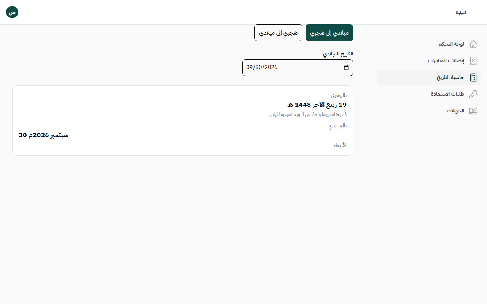

تحوّل بين التاريخ الهجري (تقويم أم القرى) والميلادي بالاتجاهين. قد يختلف الهجري يومًا واحدًا عن الرؤية الشرعية.

---

## 8. قائمة المستخدم وتسجيل الخروج

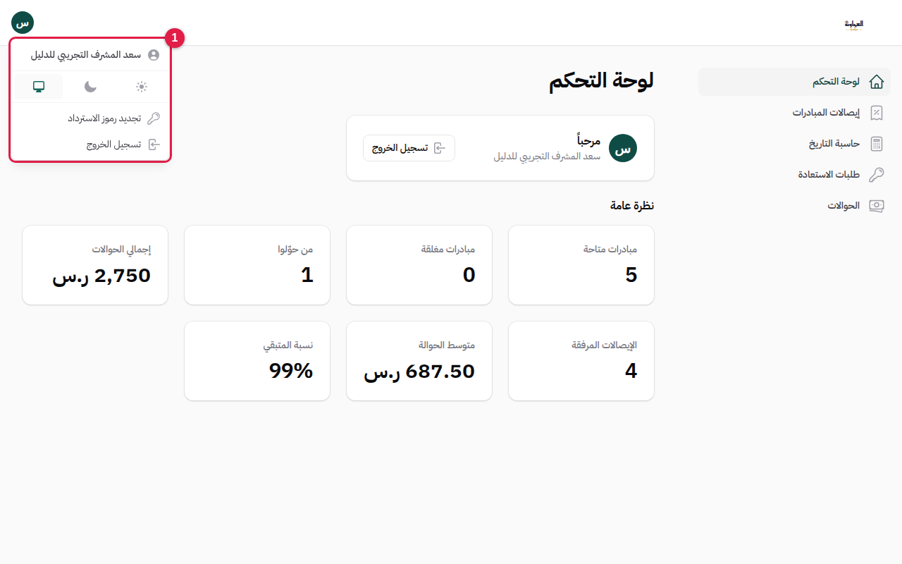

1. تفتح بالضغط على الدائرة التي فيها أول حرف من اسمك، أعلى الشاشة. فيها:
   - تبديل الوضع: فاتح أو داكن أو حسب الجهاز.
   - **تسجيل الخروج.**
   - "تجديد رموز الاسترداد" خاص بالتحقق بخطوتين، وهو غير مفعّل حاليًا، فتجاهله.

---

## 9. نسيت كلمة مروري

صفحة "نسيت كلمة المرور" العامة مخصصة للمبادرين. أنت كمشرف:

1. أخبر **المدير**.
2. يصدر لك المسؤول التقني رابطًا من لوحة Laravel Cloud، صالحًا **48 ساعة ولمرة واحدة**.
3. افتح الرابط، ثم اكتب **رقم جوالك**، ثم كلمة المرور الجديدة وتأكيدها.
4. بعد التعيين يُسجَّل خروجك من كل الأجهزة، فادخل من جديد.

---

## 10. قواعد مهمة

- لا تشارك رابط الدعوة أو رابط الاستعادة مع أحد.
- لا تعدّل صلاحياتك بنفسك، ولا تستطيع منح غيرك صلاحية لا تملكها.
- كل إجراء في اللوحة يُسجَّل في سجل تدقيق لا يُعدَّل ولا يُحذف.
- بيانات المبادرين أمانة: لا تنسخها ولا ترسلها خارج اللوحة.

