

# دليل المستخدم (المبادر)

دليل مختصر لكل من يريد أن يدعم مبادرة زواج في **مبادرة العجاونة**: كيف تتصفّح المبادرات، وتنشئ حسابك، وتحوّل، وترفع إيصالك، وتستعيد كلمة المرور إن نسيتها.

> الأرقام الحمراء في الصور تشير إلى الخطوات المشروحة تحت كل صورة. الصور من نسخة تجريبية بأسماء وهمية.

**المحتويات**

1. [الصفحة الرئيسية](#1-الصفحة-الرئيسية)
2. [المبادرات وبيانات الحساب](#2-المبادرات-وبيانات-الحساب)
3. [إنشاء حساب](#3-إنشاء-حساب)
4. [تسجيل الدخول](#4-تسجيل-الدخول)
5. [لوحتي](#5-لوحتي)
6. [رفع حوالة](#6-رفع-حوالة)
7. [حوالاتي](#7-حوالاتي)
8. [نسيت كلمة المرور](#8-نسيت-كلمة-المرور)
9. [أسئلة شائعة](#9-أسئلة-شائعة)

---

## قبل أن تبدأ

- **الموقع لا يستقبل المال.** تحوّل من تطبيق بنكك مباشرة إلى حساب المستفيد نفسه، ثم ترفع الإيصال في الموقع.
- **كل ما يُجمع لمستفيد يُسلَّم له كاملًا**، سواء بلغ الهدف أو لم يبلغه أو زاد عليه.
- **اسمك في القوائم العامة:** يظهر اسمك الأول فقط، أما اسمك الكامل فتراه الإدارة وحدها.

---

## 1. الصفحة الرئيسية

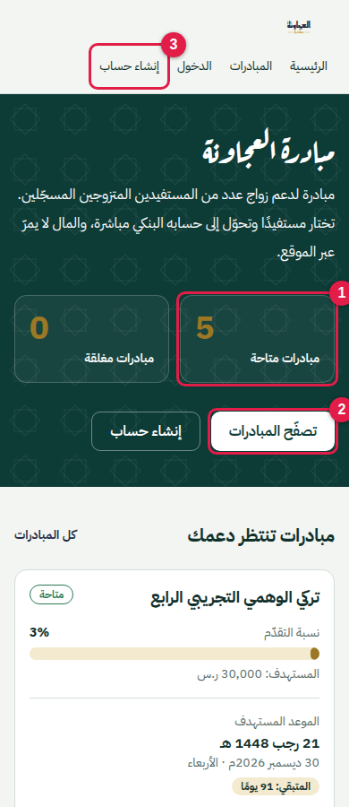

1. **عدد المبادرات:** المتاحة التي تستقبل الحوالات الآن، والمغلقة التي اكتملت أو أغلقتها الإدارة.
2. **تصفّح المبادرات:** يفتح قائمة كل المبادرات.
3. **إنشاء حساب:** تحتاجه فقط لرفع إيصال حوالتك.

تحت ذلك تظهر بطاقات المبادرات:

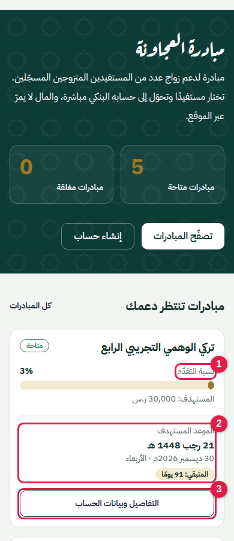

1. **نسبة التقدّم:** ما جُمع حتى الآن من المبلغ المستهدف.
2. **الموعد المستهدف:** بالهجري والميلادي، مع عدد الأيام المتبقية.
3. **التفاصيل وبيانات الحساب:** يفتح صفحة المبادرة وفيها الحساب البنكي.

---

## 2. المبادرات وبيانات الحساب

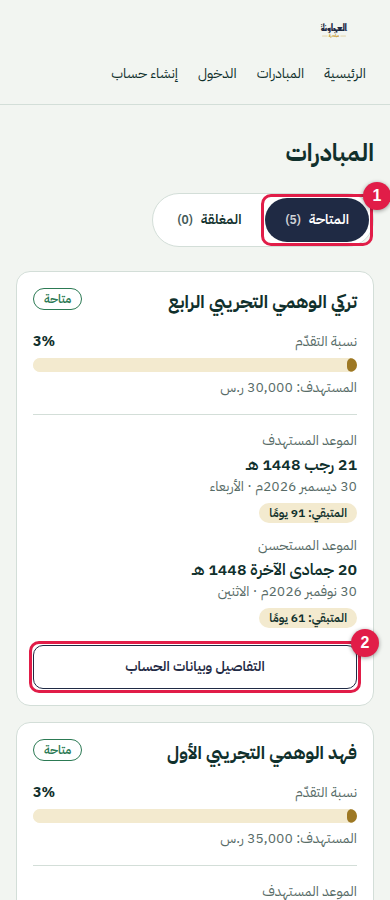

1. **تبويبا المتاحة والمغلقة:** اختر "المتاحة" لترى المبادرات التي تستقبل الحوالات.
2. **التفاصيل وبيانات الحساب:** يفتح صفحة المبادرة.

في صفحة المبادرة:

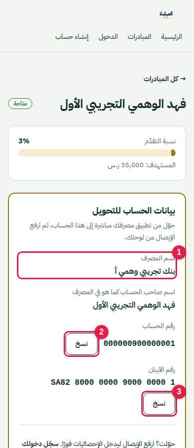

1. **اسم المصرف واسم صاحب الحساب** كما هو في المصرف. تأكد أنه يطابق ما يظهر في تطبيق بنكك قبل التحويل.
2. **نسخ رقم الحساب.**
3. **نسخ رقم الآيبان.** بعد الضغط تظهر رسالة "تم النسخ"، والصقه في تطبيق بنكك.

> المبادرة المغلقة لا تعرض بيانات الحساب، فلا تحوّل إليها.

---

## 3. إنشاء حساب

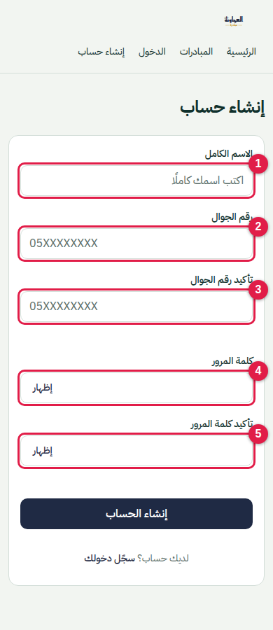

1. **الاسم الكامل:** أربعة أسماء على الأقل، بحروف عربية أو لاتينية.
2. **رقم الجوال:** رقم سعودي يبدأ بـ `05`. هذا الرقم هو اسم الدخول، وهو الطريق الوحيد لاستعادة حسابك، فاكتبه بدقة.
3. **تأكيد رقم الجوال:** اكتبه مرة ثانية. تظهر علامة ✓ إذا تطابق الرقمان.
4. **كلمة المرور:** 8 أحرف على الأقل، ولا تكون رقم جوالك. زر "إظهار" يعرضها.
5. **تأكيد كلمة المرور.**

الحساب يعمل فورًا بعد الإنشاء، وتدخل مباشرة إلى "لوحتي".

> إن ظهرت رسالة "هذا الرقم مسجّل مسبقًا" فعندك حساب من قبل: سجّل دخولك، أو استعد كلمة المرور (القسم 8).

---

## 4. تسجيل الدخول

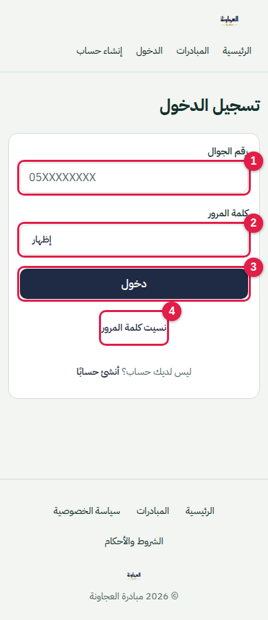

1. **رقم الجوال.**
2. **كلمة المرور.**
3. **دخول.**
4. **نسيت كلمة المرور:** انظر القسم 8.

> بعد 5 محاولات خاطئة يُقفل الدخول مؤقتًا. انتظر المدة الظاهرة في الرسالة ثم حاول مرة أخرى.

---

## 5. لوحتي

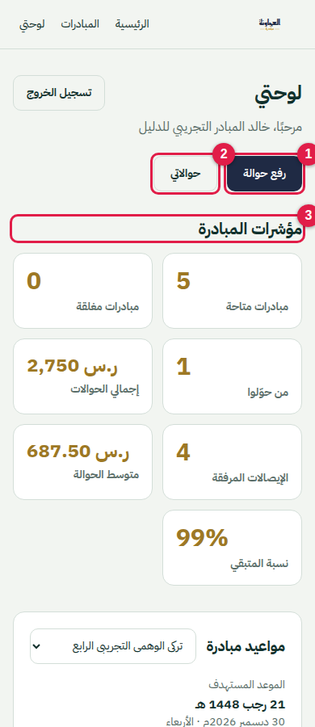

1. **رفع حوالة:** بعد أن تحوّل من تطبيق بنكك.
2. **حوالاتي:** كل حوالاتك السابقة.
3. **مؤشرات المبادرة:** إجمالي ما جُمع، وعدد من حوّلوا، ومتوسط الحوالة، والمتبقي.

وتحت المؤشرات مواعيد أي مبادرة تختارها من القائمة، وأحدث الحوالات.

---

## 6. رفع حوالة

**الخطوات بالترتيب:**

1. افتح صفحة المبادرة وانسخ الآيبان (القسم 2).
2. حوّل المبلغ من تطبيق بنكك، واحفظ صورة الإيصال.
3. ارجع للموقع واضغط **رفع حوالة**.

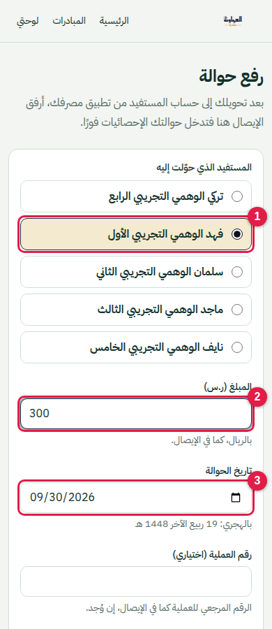

1. **المستفيد الذي حوّلت إليه:** اختر نفس المستفيد الذي حوّلت إلى حسابه.
2. **المبلغ** بالريال، كما في الإيصال.
3. **تاريخ الحوالة.** يظهر تحته التاريخ الهجري.

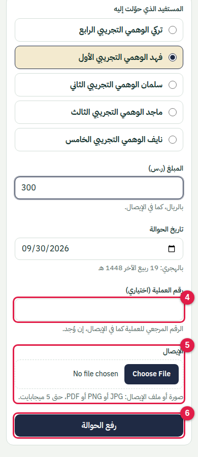

4. **رقم العملية (اختياري):** الرقم المرجعي المكتوب في الإيصال إن وُجد.
5. **الإيصال:** صورة أو ملف بصيغة JPG أو PNG أو PDF، حتى 5 ميجابايت.
6. **رفع الحوالة.**

تدخل حوالتك في الإحصائيات **فورًا**. وقد يطابقها المشرفون لاحقًا مع الإيصال.

---

## 7. حوالاتي

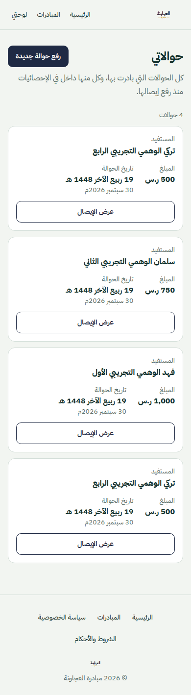

تجد هنا كل حوالة رفعتها: المستفيد، والمبلغ، والتاريخ، والإيصال.

---

## 8. نسيت كلمة المرور

لا يوجد بريد إلكتروني ولا رسائل تلقائية. الاستعادة تتم بمساعدة أحد المشرفين عبر واتساب.

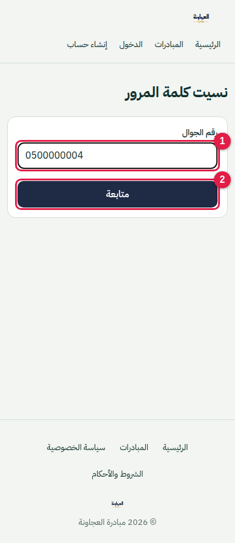

1. اكتب **رقم جوالك المسجّل**.
2. اضغط **متابعة**.

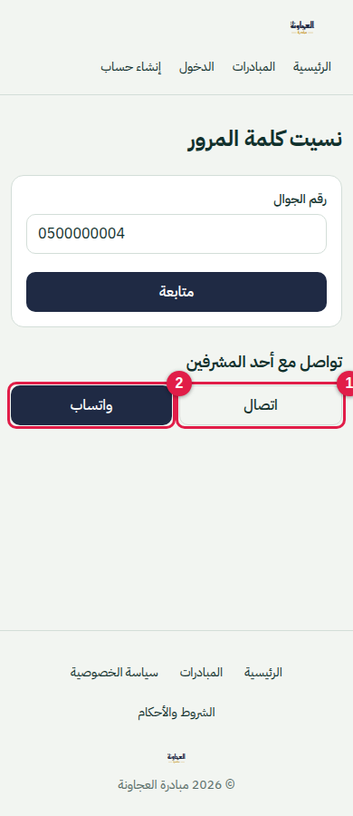

1. **اتصال:** يتصل بأحد المشرفين.
2. **واتساب:** يراسله.

بعد ذلك:

- يتأكد المشرف من اسمك ورقمك فقط، **ولن يسألك** عن مبلغ أو تاريخ أي حوالة.
- يرسل لك رابطًا على واتساب، صالحًا **30 دقيقة ولمرة واحدة**.
- افتح الرابط واكتب كلمة المرور الجديدة وتأكيدها.
- بعد التغيير يُسجَّل خروجك من كل الأجهزة، فسجّل دخولك من جديد.

> لا تشارك الرابط مع أحد. المشرف لا يرى كلمة مرورك الجديدة أبدًا.

---

## 9. أسئلة شائعة

**هل يمرّ المال عبر الموقع؟**
لا. التحويل من تطبيق بنكك إلى حساب المستفيد مباشرة.

**متى تُحتسب حوالتي؟**
فور رفع الإيصال.

**أخطأت في مبلغ أو مستفيد عند الرفع، ماذا أفعل؟**
تواصل مع الإدارة من صفحة "اتصل بنا" إن كانت متاحة، أو عبر أحد المشرفين.

**هل يظهر اسمي للعامة؟**
الاسم الأول فقط في قائمة أحدث المبادرات.

**غيّرت رقم جوالي، كيف أحدّثه؟**
اطلب "نسيت كلمة المرور" برقمك القديم إن كان يعمل، وأخبر المشرف بالرقم الجديد. المشرف المخوّل يستطيع تعديل رقم الدخول بعد التحقق منك.

